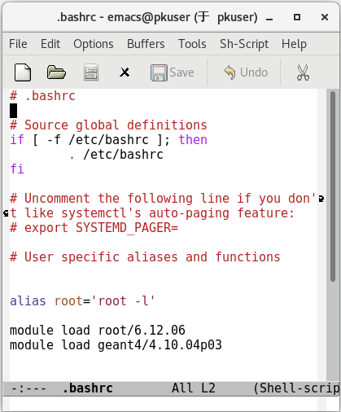

<!-- README.md --- 
;; 
;; Description: 
;; Author: Hongyi Wu(吴鸿毅)
;; Email: wuhongyi@qq.com 
;; Created: 六 6月 29 21:56:56 2019 (+0800)
;; Last-Updated: 五 4月 15 15:58:15 2022 (+0800)
;;           By: Hongyi Wu(吴鸿毅)
;;     Update #: 46
;; URL: http://wuhongyi.cn -->

# README

- 如果需要其它软件/版本，请联系管理员安装。
- 安装多版本及多版本的任意切换，目的在于对软件进行测试。ROOT/GEANT4属于发展中的软件，还有很多问题，当你发现程序存在问题一直无法解决时，可以更换其它版本测试是否是该版本存在问题。


Environment modules 提供了一种设置shell环境（PATH, MANPATH, INCLUDE, LD\_LIBRARY\_PATH）的方法，通过使用module命令，来设置和取消你的路径和环境变量。

记住以下常用命令

```bash
module avail   #显示可以使用的模块 
module load    #加载模块 
module unload  #卸载模块 
module list    #显示已经加载的模块
```

## 加载配置

在命令行中执行以下命令查看当前可加载的软件

```bash
module avail
```

以 **服务器30** 为例，你将会看到如下

```
------------------------ /usr/share/Modules/modulefiles ------------------------
dot         module-git  module-info modules     null        use.own

------------------------------- /etc/modulefiles -------------------------------
cmake/3.14.5      geant4/4.10.01p03 geant4/4.9.6p04   root/6.12.06
cmake/3.7.2       geant4/4.10.02p03 mpich-x86_64      root/6.16.00
gcc/4.9.4         geant4/4.10.03p03 python/2.7.16
gcc/7.3.0         geant4/4.10.04p03 python/3.6.9
geant4/4.10.00p04 geant4/4.10.05p01 root/5.34.38
```

例如你想使用 root5.34.38，则输入以下命令即可加载所需的环境

```bash
module load root/5.34.38
```


**服务器 30 与 服务器 64 由于系统版本不同，30 系统自身软件版本较低，因此在使用 30 服务器时，需要加载的配置多一些。每个人根据使用的服务器查看以下对应的说明即可。**


例如你想使用 geant4.10.04p03，则 **服务器30** 输入以下命令即可加载所需的环境

```bash
module load gcc/4.9.4
module load cmake/3.7.2
module load geant4/4.10.04p03
```

在 **服务器64** 则只需要输入以下命令即可 

```bash
module load geant4/4.10.04p03
```

当然，每次打开终端都要这样配置也没有必要，可将常用软件版本配置添加在 **.bashrc** 文件中。如何配置请看以下对应服务器的说明。


## 服务器 30

安装多版本的软件有
- gcc
	- 4.4.7 系统默认
	- 4.9.4 (ok)
	- 7.3.0 (ok)
- cmake
	- 2.8.12.2  系统默认
	- 3.7.2 (ok)
	- 3.14.5 (ok) 依赖gcc4.9.4
- python
	- 2.6.6 系统默认
	- 2.7.16 (ok)
	- 3.6.9 (ok)
- root
	- 5.34.38 (ok)
	- 6.12.06 (ok) 依赖gcc4.9.4,cmake3.7.2,python3.6.9
	- 6.16.00 (no) 依赖gcc4.9.4,cmake3.7.2,python3.6.9
- geant4
	- 4.9.6p04   (ok) 依赖gcc4.9.4,cmake3.7.2
	- 4.10.00p04 (ok) 依赖gcc4.9.4,cmake3.7.2
	- 4.10.01p03 (ok) 依赖gcc4.9.4,cmake3.7.2
	- 4.10.02p03 (ok) 依赖gcc4.9.4,cmake3.7.2
	- 4.10.03p03 (ok) 依赖gcc4.9.4,cmake3.7.2
	- 4.10.04p03 (ok) 依赖gcc4.9.4,cmake3.7.2
	- 4.10.05p01 (ok) 依赖gcc4.9.4,cmake3.7.2

**软件后面注释的软件依赖，意味着你要使用该软件，则需要加载相对应的依赖软件。**


懒人模式，快速配置 ROOT/GEANT4，在 *.bashrc* 添加以下配置即可

```bash
## 根据需要选择想要的版本

module load root/5.34.38

module load gcc/4.9.4
module load cmake/3.7.2
module load geant4/4.10.04p03
```

记得删除 *.bashrc* 中之前 source 的配置。


## 服务器 64

安装多版本的软件有
- gcc
	- 4.9.2 系统默认
	- 7.3.0 (ok)
	- 9.3.0 (ok)
- cmake
	- 3.10.3  系统默认
- emacs	
	- 24.3.1  系统默认
- python
	- 2.7.5 系统默认(python2)
	- 3.6.8 系统默认(python3) 
- vim
	- 7.4 系统默认
	- 8.0 (ok)
- root
	- 5.34.38 (ok)
	- 6.06.08 (ok)
	- 6.12.06 (ok)
	- 6.14.06 (ok)
	- 6.16.00 (ok)
	- 6.20.06 (ok)
- geant4
	- 4.9.6p04   (ok) 
	- 4.10.00p04 (ok) 
	- 4.10.01p03 (ok) 
	- 4.10.02p03 (ok) 
	- 4.10.03p03 (ok) 
	- 4.10.04p03 (ok) 
	- 4.10.05p01 (ok) 
	- 4.10.06p03 (ok)
	- 4.10.07p03 (ok)
- opencv
	- 4.4.0 (ok)

懒人模式，快速配置 ROOT/GEANT4，在 *.bashrc* 添加以下配置即可

```bash
## 根据需要选择想要的版本

module load root/5.34.38

module load geant4/4.10.04p03
```

记得删除 *.bashrc* 中之前 source 的配置。

下图为吴鸿毅在服务器64上的个人配置



## 关于 jupyter

首先找管理管分配端口号。

然后复制参考配置文件 */data/d3/README/jupyter_notebook_config.py* 到服务器上个人的某个文件夹。该文件夹为您 jupyter 的根目录。

文件的头部会有端口、密码的配置。


```bash
#将 8888 改成您的端口号
c.NotebookApp.port = 8888
```

查询个人分配的端口 [端口号查询](Setup64.md)

如果需要设置访问密码

```bash
#设置访问密码 本设置的密码为 wuhongyi ，需要修改成您自己的密码
c.NotebookApp.password = u'sha1:b4312c4fb8b5:e239f220fa9fc697668ec3dc71b4180ee8854dac'
```

如果没有设置密码（将该行设置注释掉），那么在访问网页的时候，会要求输入 token ，token 在终端的输出信息中有。

建议配置个人密码，方便访问。生成密码的方式如下：

打开ipython, 创建一个密文密码

```bash
In [1]: from notebook.auth import passwd

In [2]: passwd()
Enter password: 
Verify password: 
Out[2]: 'sha1:ecff44b879cd:35b5b64072d286b66f0d8f84a41dbf7515d21755'
```

把生成的密文 *sha1:ec…* 复制下来替换成以上配置文件中的密码。

完成以上配置之后，即可启动 jupyter。将终端进入到放置 *jupyter_notebook_config.py* 文件的目录。然后执行以下命令：

```bash
root --notebook
```

之后，您可在任意电脑中通过 *xxx.xxx.xxx.64:8888* 来访问。（其中xxx 为 64 服务器 IP，8888 替换成您的端口号）

如果要让该服务保持在后台，可以使用 **screen** 命令。


## 其它软件

- [Visual Studio Code](VisualStudioCode.md)
- [nushellx](nushellx.md)
- [RadWare](RadWare.md)
- [GRAZING](GRAZING.md)

## 关于网络

30/64 服务器为数据处理服务器，为了安全，没有直接连上公网，当前通过我们的28网络服务器来作为中转。

如果你需要访问外网下载或者上传数据，则在 *.bashrc* 添加以下配置即可

```bash
#添加Proxy代理信息
export http_proxy=http://162.105.151.28:3128/
export https_proxy=http://162.105.151.28:3128/
```

## 关于如何配置多版本

如果你对如何实现软件多版本配置感兴趣，可查看 **/etc/modulefiles** 目录下的配置，以及 Baidu/Google 关键词 **Environment Modules**。

## 并行编程指南

写了一份并行编程指南，讲解并行编程和如何使用CUDA。

[点击这里！](https://goodcucumber.github.io/x40paraguide/)

一些例子程序在 ->[这里](https://github.com/goodcucumber/x40paraguide/tree/master/samples)<-
	
<!-- README.md ends here -->
